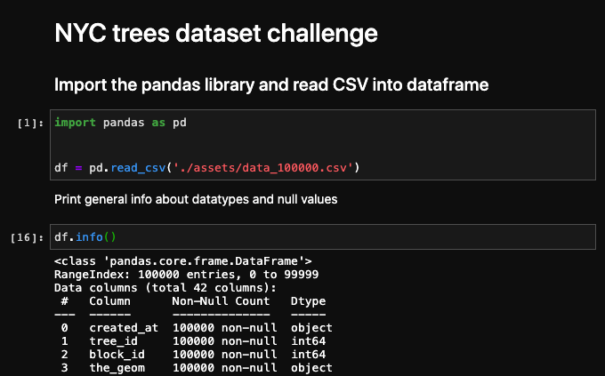

# NYC-trees
> `Challenge` solo project to read and pre-process a dataset from a CSV file and export the result.

## Table of contents
* [General info](#general-info)
* [Screenshots](#screenshots)
* [Technologies](#technologies)
* [Setup](#setup)
* [Features](#features)
* [Status](#status)
* [Contact](#contact)

## General info
The purpose of the challenge is to learn how to read a CSV file and pre-process the data using the pandas library
in dataframe object taking into account the following:

- Can values be consolidated? (e.g. Truck and truck refer to the same thing)
- Are there some columns where most of the data is missing ?
- Can you fill in some missing values ?
- Is the date format correct?
- Are some values integers that should be float or vice-versa ? Change the dtype.

## Screenshots

## Technologies

* Python programming language
* pandas
* Jupyter notebook

## Setup
You can clone or fork this repository and test the files.

## Features
The challenge features are as follow:

1. Notebook with the steps and code of the actions performed in pre-processing and exporting the result.
2. Output file in CSV format with all the pre-processing actions completed.

## Status
Challenge is: finished, final version.

## Contact
Created by [@ferrycosv](www.github.com/ferrycosv) - feel free to contact me!